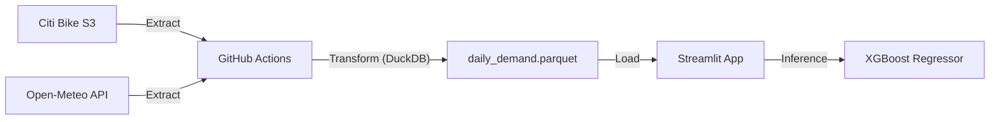

# UrbanPulse — NYC Bike-Share Demand Predictor


UrbanPulse is a small end-to-end data project that predicts hourly bike demand in NYC using Citi Bike trips and public weather data.

It’s built to be simple, reproducible and cheap to run: everything lives in GitHub, DuckDB handles analytics, and Streamlit serves the app.


---


## Problem


Bike-sharing systems constantly need to rebalance stations:


* Residential stations empty out in the morning.

* Business districts fill up at the same time.

* Weather changes usage patterns more than most people expect.


The goal here is not to be “perfect”, but to automate the pipeline and provide a clear way to explore demand and simulate scenarios.


---


## Architecture


No cloud warehouse, no paid services.

GitHub Actions runs the pipeline, DuckDB does the heavy lifting.





### Data Flow


1.  **Ingestion**

A scheduled GitHub Action downloads Citi Bike data and pulls weather from Open-Meteo.


2.  **Transformation**

DuckDB cleans, aggregates and joins everything in memory.


3.  **Storage**

The result is a small Parquet file committed back to the repo.


4.  **Serving**

Streamlit loads the data and the trained model to run predictions.


---


## Model & Features


The model is an **XGBoost Regressor** trained on aggregated hourly demand.


Main features:


*  **Cyclical time encoding**

Sine/Cosine for `hour` and `day_of_week` so midnight and 23:00 are close.


*  **Target encoding (stations)**

Historical station demand profiles computed only from training data.


*  **Lag features**


*  `trip_count_lag1`: previous hour demand

*  `trip_count_rolling3`: 3-hour rolling mean


> In the app, lag values are approximated using historical lookups derived from training data to avoid leakage.


---


## Dashboard


The app is split into three views:


### 1. Pipeline Status


* File size, last update, row count

* Raw data preview


### 2. EDA


*  **3D map** (PyDeck ColumnLayer) for trip density

*  **Charts** for top stations and hourly patterns


### 3. Demand Prediction


* Sliders for hour, temperature, rain

*  **Scatterplot map** of predicted demand

* Top stations by expected demand


---


## Repository Layout


```text

├── .github/workflows # Monthly ETL + retraining

├── data/

│ ├── raw/ # Temporary CSVs (gitignored)

│ └── processed/ # Aggregated parquet data

├── src/

│ ├── etl.py # DuckDB pipeline

│ └── train.py # Feature engineering + XGBoost

├── app.py # Streamlit app

├── requirements.txt

└── README.md

```


---


## Running Locally


Clone:


```bash

git  clone  https://github.com/obocanegra-dev/UrbanPulse-NYC-Predictor.git

cd  UrbanPulse-NYC-Predictor

```


Install:


```bash

pip  install  -r  requirements.txt

```


Run ETL:


```bash

python  src/etl.py

```


Train model:


```bash

python  src/train.py

```


Launch app:


```bash

streamlit  run  app.py

```


---


## Tech Stack


*  **Python 3.10**

*  **DuckDB** (in-memory analytics)

*  **GitHub Actions** (orchestration)

*  **XGBoost + scikit-learn**

*  **Streamlit, PyDeck, Altair**
